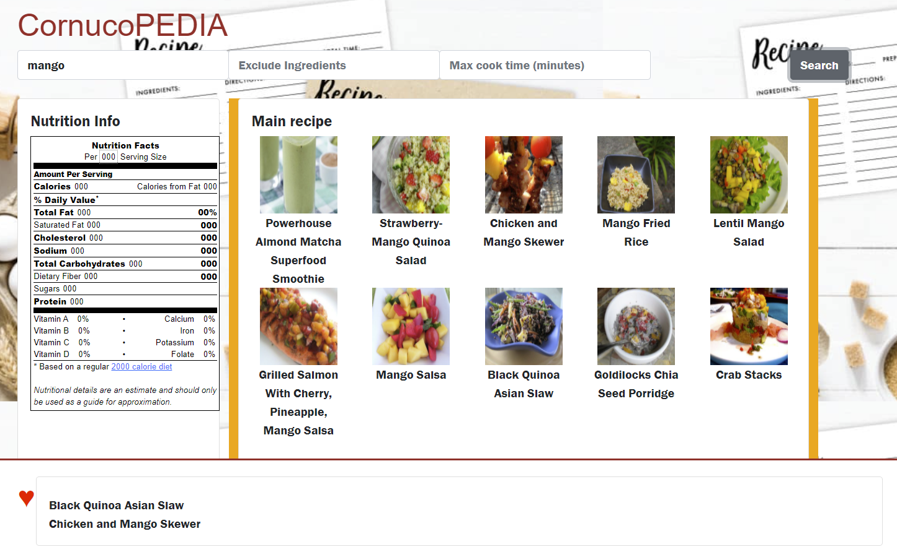
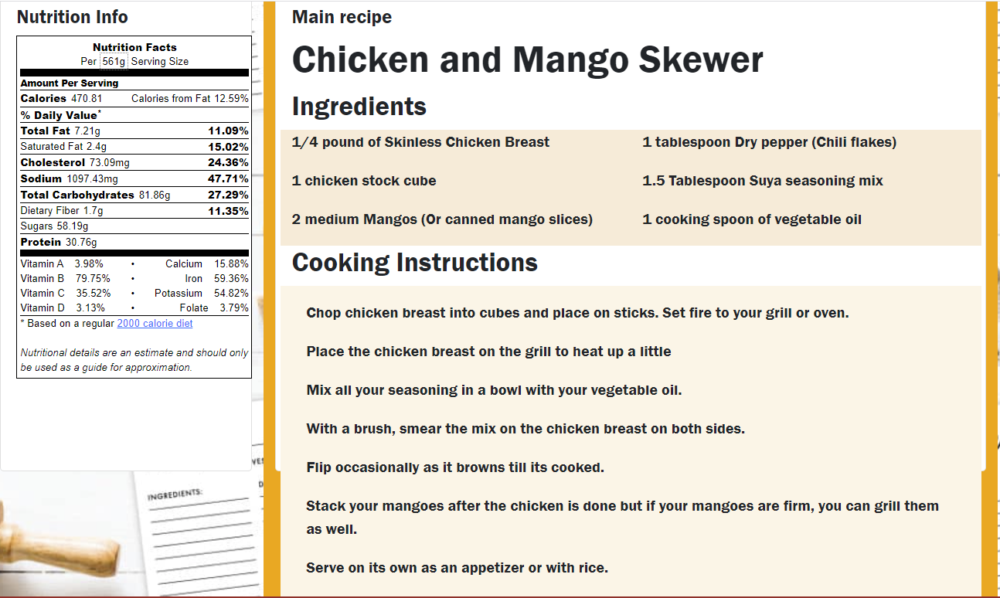

# Cornucopedia
Welcome to Cornucopedia! 

Here the user will find a simple web-based app to create recipes based on the products that are already in your kitchen. Simply input your ingredients and let Cornucopedia do the work- discover new recipes and nutritional information with one click.

No special installation required. Cornucopedia will run in any web browser. To use, navigate to the website and enter your ingredient list. Cornucopedia will find recipes for you. If you see one you like, save it to the cookbook to use later and continue searching. 

## Usage

Enter your ingredients into the "Include ingredients box".
If you want to exclude ingredients, enter them into the "exclude ingredient box".
If you need to limit the time needed, enter that into "max cook time".

Clicking Search will bring up a list of recipes.

- Drag a recipe to the favorites box on the bottom to store it.
- Click a recipe in the Main Recipe window or in the Favorites box to bring up instructions and nutrition information.

## Contributors

Thanks to:

    Todd Malone
    Amin Bashir
    Sam Meier
    Justin Rovnak

for contributing to the project. 

## Links

[Source repository](https://github.com/Athear/cornucopedia)

[Live project](https://athear.github.io/cornucopedia/)

## License

Licensed under the [MIT](./LICENCE.txt) license
